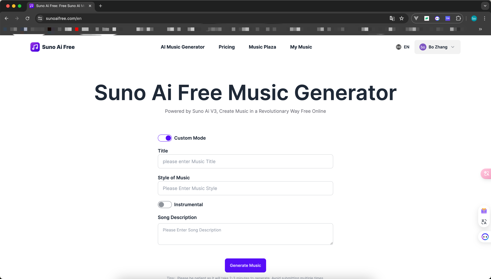
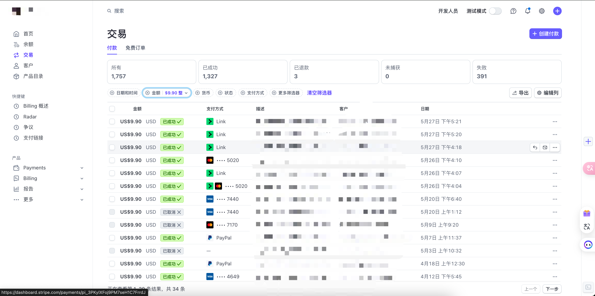

# [Suno Ai Free](https://sunoaifree.com/)

## Home

## Description

Suno Ai Free was launched around April this year; it is currently a project that has been validated and made profitable in overseas markets. With an awareness of open source and collaboration, we hope to incubate superior commercialized projects based on this open-source project, to better meet the demands of overseas markets. All code is completely open-source and usable.

## One-Click Deploy

Deploy the example using [Vercel](https://vercel.com?utm_source=github&utm_medium=readme&utm_campaign=vercel-examples):

## Stack

Suno Ai Free is built on the following stack:

- [Next.js](https://nextjs.org/docs)
- [Vercel](https://vercel.com/docs)
- [Stripe](https://dashboard.stripe.com/login)
- [Supabase](https://supabase.com/)
- [Antd](https://ant-design.antgroup.com)
- [Tailwindcss](https://www.tailwindcss.cn/docs/container)
- [Daisyui](https://daisyui.com/)

